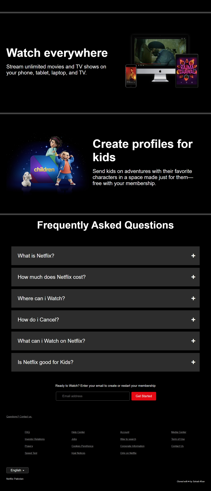

# 🎬 Netflix Pakistan – Landing Page Clone

A responsive, modern Netflix landing page clone built with pure HTML, CSS, and JavaScript (no frameworks). This project mimics the look and feel of Netflix Pakistan's homepage with localized design and user interaction effects.

---

## 🔥 Features

- Responsive design across screen sizes
- Hero section with email input and CTA
- Multiple feature highlight sections
- Interactive accordion-based FAQ section
- Smooth scrolling using **Locomotive Scroll**
- Clean footer with useful links

---

## 📷 Screenshots

---

---

## 🚀 Technologies Used

- HTML5
- CSS3 (Media Queries, Animations, Flexbox)
- JavaScript (Vanilla DOM manipulation)
- Locomotive Scroll library

---

## 👨 Author

**Sohaib Kundi**  
Frontend Developer | UI/UX Learner  
[GitHub](https://github.com/sohaibkundi2) • [LinkedIn](https://linkedin.com/in/sohaibkundi2)

> “Practice makes progress — every project takes me one step further.”

### Note:

> This project is for educational and portfolio purposes only. All assets are owned by Netflix.
